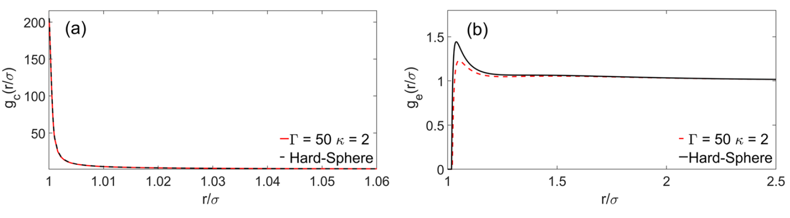

# Colloids in shear flow

MATLAB codes accompanying:

1. Banetta & Zaccone, Physical Review E 99, 052606 (2019)
2. Banetta & Zaccone, Colloid and Polymer Science 298, 761–771 (2020)

The repository computes radial/pair distribution functions of interacting colloidal particles under shear flow using intermediate asymptotics solutions of the Smoluchowski equation.

---

## Example result

Radial distribution function of interacting colloids under shear flow (averaged over compressional and extensional sectors of the solid angle).



---

## Repository structure

`src/`
: core numerical routines

`examples/`
: scripts reproducing the published results

`notebooks/`
: Mathematica derivations and symbolic calculations

`results/`
: generated figures and output data

`legacy/`
: deprecated or experimental scripts

---

## Reproducing the PRE 2019 Lennard-Jones results

```matlab
cd examples/reproduce_PRE_2019
run_LJ_compression
run_LJ_extension
